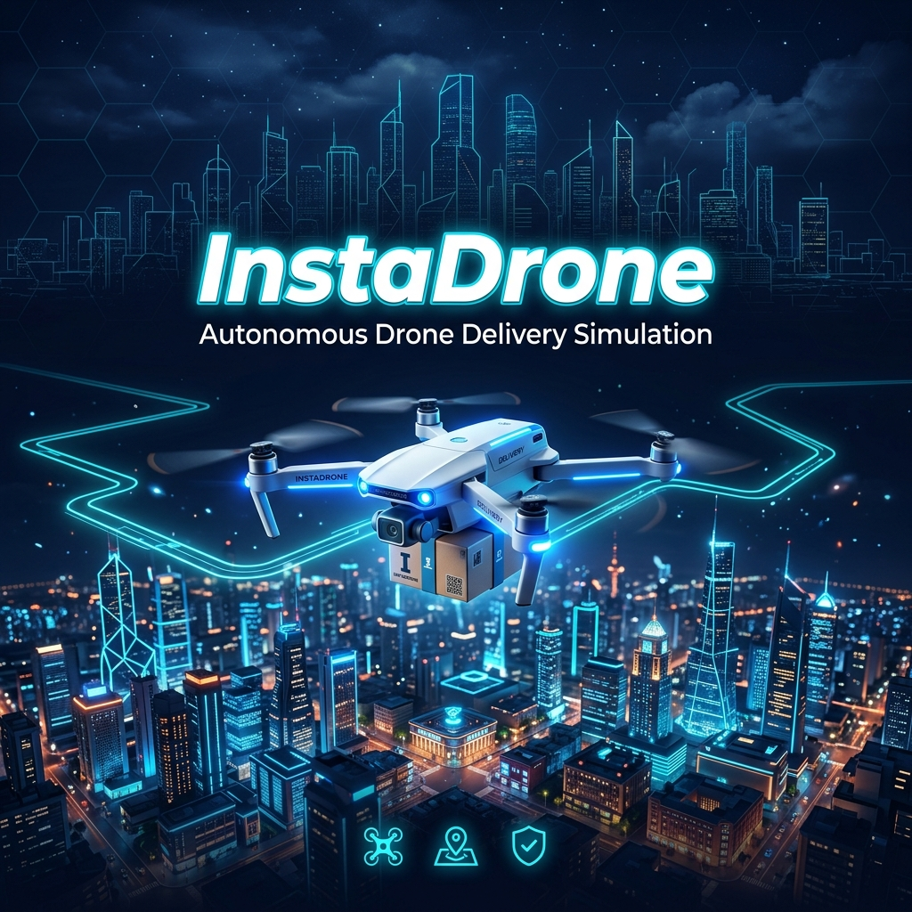
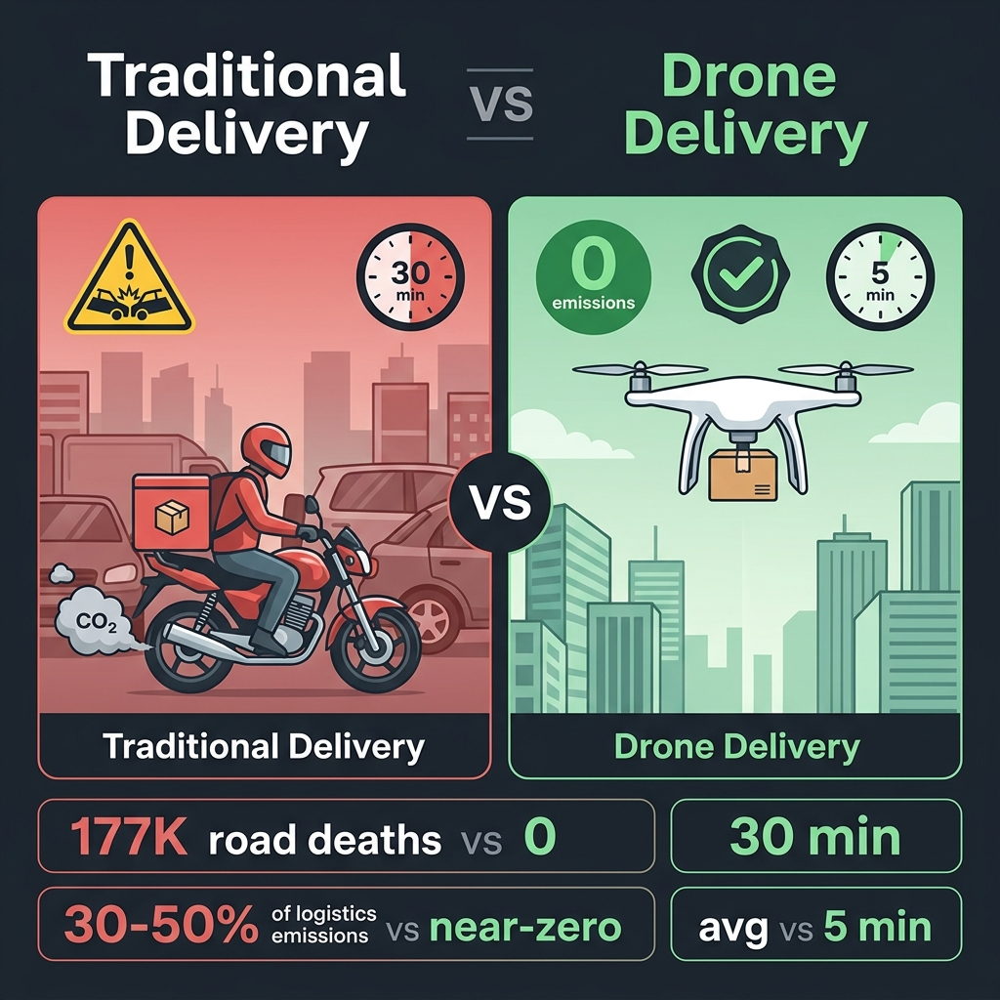
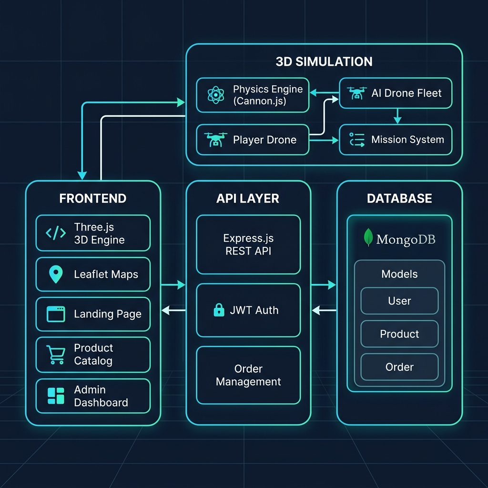
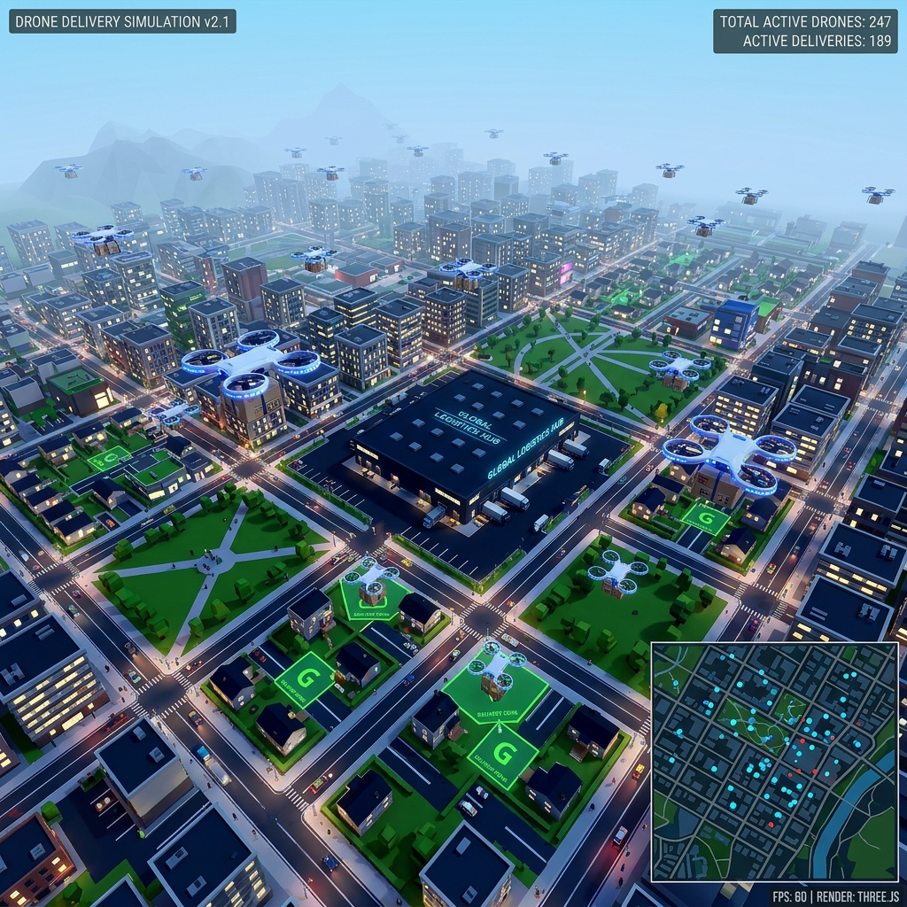

<p align="center">
  
</p>

<h1 align="center">🚁 InstaDrone</h1>

<p align="center">
  <strong>A full-stack autonomous drone delivery simulation platform — reimagining last-mile logistics to save lives and the planet.</strong>
</p>

<p align="center">
  <a href="#-live-demo"></a>
  <a href="#-the-problem"></a>
  <a href="#-the-problem"></a>
</p>

<p align="center">
  
  
  
  
  
  
  
</p>

---

## 🎯 Built for a Competitive Builder Event

> *Built for a competitive builder event — April 2026, Bengaluru.* Projects are judged on **innovation, technical depth, clarity of thinking, and real-world impact**.

InstaDrone was built to prove one thing: **the future of delivery doesn't need to cost human lives**.

---

## 💀 The Problem

Every time you order groceries on a 10-minute delivery app, a human being risks their life to bring it to you.

<p align="center">
  
</p>

### The Human Cost

| Metric | Stat | Source |
|--------|------|--------|
| 🇮🇳 Road accident deaths in India (2024) | **177,177** | Ministry of Road Transport |
| Delivery workers in "high-risk demographic" | Two-wheeler riders under time pressure | India Times |
| Delivery agents in accidents (Chennai, 2025 alone) | **43** including multiple fatalities | India Times |
| US delivery driver heat-related deaths (2023) | **3+ confirmed** | Occupational safety reports |

Delivery workers — predominantly young, gig-economy workers on two-wheelers — are among the most vulnerable road users. They face:
- ⏱️ **Extreme time pressure** ("10-minute delivery" culture)
- 🛵 **Dangerous road conditions** (congestion, poor infrastructure)
- 🌡️ **Weather exposure** (heatwaves, monsoons)
- 💰 **No insurance or safety nets** (gig economy classification)

### The Environmental Cost

| Metric | Stat |
|--------|------|
| Last-mile delivery's share of total logistics CO₂ | **30–50%** |
| Projected increase in urban last-mile emissions by 2030 | **+30%** |
| Average CO₂ per single parcel delivery | **204 grams** |
| Fossil-fuel vehicles causing sustainability issues in logistics | **~70%** |

> *"Last-mile delivery is the most expensive, least efficient, and most polluting segment of the entire supply chain."* — World Economic Forum

---

## 💡 The Solution: InstaDrone

**What if no human ever had to risk their life for a grocery delivery again?**

InstaDrone is a **full-stack simulation platform** that proves autonomous drone delivery is not just viable — it's **urgently necessary**. We built a complete, interactive 3D city where you can:

✅ **Fly a physics-based drone** through a procedurally generated city  
✅ **Pick up and deliver packages** with realistic physics constraints  
✅ **Command an AI drone fleet** for autonomous multi-drop deliveries  
✅ **Track everything in real-time** on an interactive 2D mini-map  
✅ **Place orders** through a full product catalog with authentication  
✅ **Monitor operations** via an admin dashboard with analytics  

### Why Simulation Matters

Before deploying a single real drone, companies need to:
1. **Test routing algorithms** in realistic urban environments
2. **Validate collision avoidance** with physics-accurate models
3. **Optimize fleet management** across dark stores and delivery zones
4. **Train operators** in safe, consequence-free environments
5. **Demonstrate viability** to regulators and investors

**InstaDrone is that testing ground.**

---

## 🎮 Live Demo

> **👉 [Try InstaDrone Live](https://instadrone-sim.vercel.app) — No installation required**

| Page | Description |
|------|-------------|
| 🏠 **Landing Page** | Marketing page with value proposition |
| 🚁 **3D Simulation** | Full physics-driven drone delivery sandbox |
| 🛒 **Product Catalog** | Browse and order products for drone delivery |
| 🔐 **Login/Register** | JWT-based authentication system |
| 📊 **Admin Dashboard** | Order management and analytics |

### Controls (Simulation)

| Key | Action |
|-----|--------|
| `W / S` | Forward / Backward |
| `A / D` | Strafe Left / Right |
| `Q / E` | Rotate Left / Right |
| `Space` | Ascend |
| `Shift` | Descend |
| `F` | Pick up / Drop package |
| `R` | Emergency reset |
| `M` | Toggle mini-map |

---

## 🏗️ Architecture

<p align="center">
  
</p>

### Tech Stack

| Layer | Technology | Why |
|-------|-----------|-----|
| **3D Engine** | Three.js v0.181 | Industry-standard WebGL renderer — 60fps cityscape |
| **Physics** | Cannon-es v0.20 | Rigid body dynamics, constraints, collision detection |
| **Maps** | Leaflet.js v1.9 | Real-time drone tracking on interactive 2D overlay |
| **Build** | Vite 7 | Instant HMR, optimized production bundles |
| **Backend** | Express.js 5 | REST API for orders, products, authentication |
| **Database** | MongoDB + Mongoose 8 | Document store for users, products, orders |
| **Auth** | JWT + bcrypt | Secure, stateless authentication |
| **Styling** | TailwindCSS 4 | Rapid, responsive UI development |

---

## 🌆 Simulation Deep Dive

<p align="center">
  
</p>

### Procedural City Generation

The city is a **5×5 grid** of blocks — each 30 units wide with 10-unit roads between them:

```
┌─────┬─────┬─────┬─────┬─────┐
│ RES │ RES │ RES │ RES │ RES │
├─────┼─────┼─────┼─────┼─────┤
│ RES │ 🌳  │ RES │ RES │ RES │
├─────┼─────┼─────┼─────┼─────┤
│ RES │ RES │ 🏭  │ RES │ RES │  ← Dark Store (Hub)
├─────┼─────┼─────┼─────┼─────┤
│ RES │ RES │ RES │ 🌳  │ RES │
├─────┼─────┼─────┼─────┼─────┤
│ RES │ RES │ RES │ RES │ RES │
└─────┴─────┴─────┴─────┴─────┘

🏭 = Dark Store (Central Warehouse)
🌳 = Parks (Green spaces)  
RES = Residential (4 buildings + delivery zone each)
```

### Physics Engine

| Feature | Implementation |
|---------|---------------|
| Gravity | `9.82 m/s²` — Earth-accurate |
| Y-axis movement | Velocity-based (stable hover, precise ascend/descend) |
| XZ movement | Force-based (realistic inertia, `damping: 0.5`) |
| Visual tilt | Faked from local velocity (max 0.3 rad) — feels natural |
| Package pickup | `CANNON.LockConstraint` — rigid physics attachment |
| Collision | Static bodies on ALL buildings, ground, walls |

### AI Drone Fleet

- **Kinematic bodies** — not affected by gravity (hovering in place)
- **Path interpolation** at 10 units/second with auto-heading
- **Console API** for fleet command:

```javascript
window.spawnDrone(0, 20, 0)        // Spawn at coordinates
window.moveDrone(0, 50, 15, -30)   // Send drone 0 to target
window.commandAllDrones(0, 15, 0)  // Rally all drones
window.countDrones()               // Fleet status
```

### Interactive Mini-Map

- **Leaflet.js** with `CRS.Simple` flat coordinate system
- **Live tracking** of player + all AI drones
- **Clickable blocks** showing sector info, building names, door ranges
- **Route visualization** with polyline drawing

---

## 📡 Backend API

Full REST API for the e-commerce layer:

### Authentication
```
POST /api/auth/register    → Create account (bcrypt hashed)
POST /api/auth/login       → JWT token (1hr expiry) with role
```

### Products
```
GET  /api/products         → Browse catalog
POST /api/products         → Add product (admin)
```

### Orders
```
POST /api/orders           → Place order (triggers drone assignment)
GET  /api/orders/:userId   → User's order history
GET  /api/orders           → All orders (admin)
GET  /api/orders/analytics/daily → Revenue & volume analytics
```

### Data Models

```javascript
// Order — the bridge between e-commerce and drone delivery
{
  user: ObjectId,
  products: [{ product: ObjectId, quantity: Number }],
  totalAmount: Number,
  status: 'pending' | 'processing' | 'delivering' | 'delivered' | 'cancelled',
  droneId: String,              // Assigned drone
  deliveryLocation: {
    lat: Number, lng: Number,   // Maps to 3D world coordinates
    address: String
  }
}
```

---

## 🚀 Getting Started

### Prerequisites
- Node.js 18+
- MongoDB (local or Atlas)

### Installation

```bash
# Clone the repository
git clone https://github.com/Charan-Tj/WorldSimulation.git
cd WorldSimulation

# Install dependencies
npm install

# Configure environment
cp .env.example .env
# Edit .env with your MongoDB URI and JWT secret
```

### Running

```bash
# Terminal 1 — Frontend (Vite dev server)
npm run dev

# Terminal 2 — Backend (Express API)
node server/index.js
# or with hot reload:
npx nodemon server/index.js
```

### Environment Variables

```env
MONGO_URI=mongodb+srv://...     # MongoDB connection string
JWT_SECRET=your-secret-key      # JWT signing secret
PORT=5000                       # Backend port (optional)
```

---

## 📊 Impact Metrics

If InstaDrone's model scaled to replace even **10%** of last-mile deliveries in India:

| Metric | Current State | With Drone Delivery |
|--------|--------------|-------------------|
| Delivery worker road deaths | ~17,700/year | **→ 0** |
| CO₂ per delivery | 204g | **→ ~14g** (93% reduction) |
| Average delivery time | 20–45 min | **→ 5 min** |
| Traffic congestion impact | Major contributor | **→ Zero road footprint** |
| Weather-related worker incidents | Hundreds annually | **→ Eliminated** |

> 📈 Studies show **drone + micro-hub models can reduce last-mile emissions by up to 93%** compared to conventional van delivery.

---

## 🗺️ Roadmap

| Feature | Status |
|---------|--------|
| 3D procedural city (5×5 grid) | ✅ Complete |
| Player drone with full physics | ✅ Complete |
| AI drone fleet (kinematic) | ✅ Complete |
| Package pickup/drop (LockConstraint) | ✅ Complete |
| Leaflet mini-map with live tracking | ✅ Complete |
| Auth API (register/login/JWT) | ✅ Complete |
| Products API + catalog UI | ✅ Complete |
| Orders API + analytics | ✅ Complete |
| Admin dashboard | ✅ Complete |
| Autonomous delivery missions | ✅ Complete |
| Real-time order → drone auto-assignment | 🔜 Next |
| Weather simulation effects | 📋 Planned |
| Multi-dark-store routing | 📋 Planned |
| Battery/range simulation | 📋 Planned |

---

## 🏆 Why This Matters

This isn't a toy demo. **InstaDrone tackles a problem that kills 177,000 people per year in India alone.**

| Evaluation Criteria | How InstaDrone Delivers |
|---------------------|------------------------|
| **Innovation** | Full 3D physics simulation of drone delivery in-browser — no downloads, no plugins |
| **Technical Depth** | Three.js + Cannon.js physics engine + Leaflet maps + Express API + MongoDB — 6 technologies orchestrated into one seamless experience |
| **Impact** | Directly addresses delivery worker mortality and logistics carbon emissions — two of India's most pressing urban challenges |
| **Shipping Signal** | Complete, interactive, deployed product — not a pitch deck |

---

<p align="center">
  <br/>
  <strong>Every delivery should arrive safely — for the package AND the person carrying it.</strong>
  <br/><br/>
  <a href="https://instadrone-sim.vercel.app">
    
  </a>
  <br/><br/>
  <sub>Built with ❤️ for a competitive builder event — April 2026, Bengaluru</sub>
</p>
